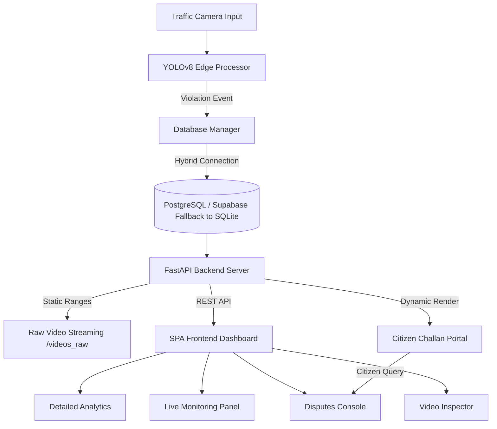
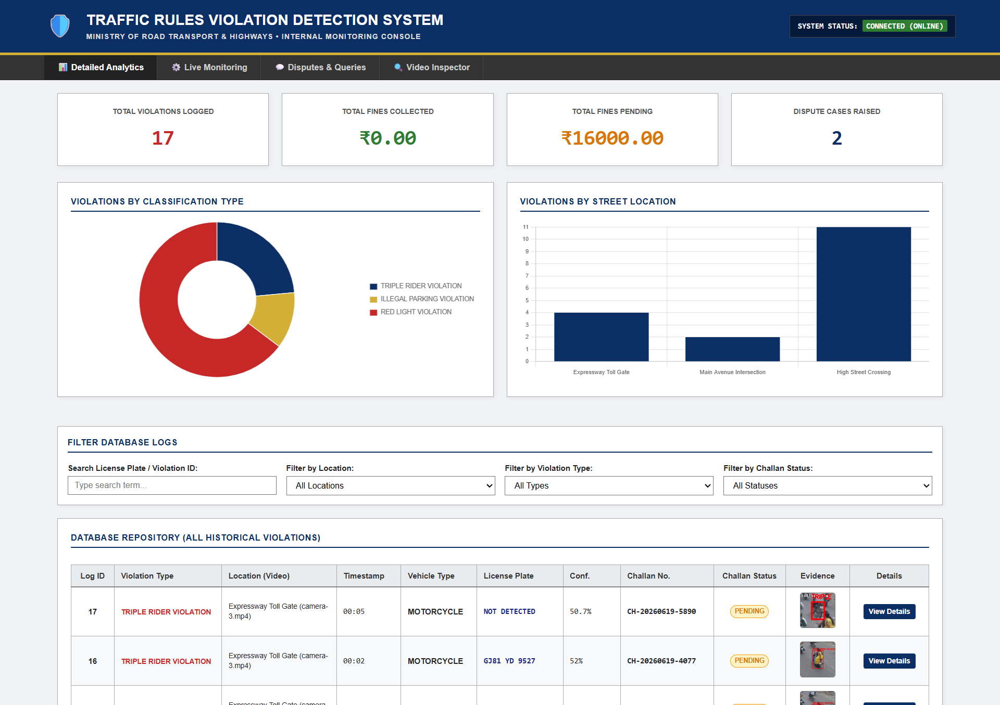
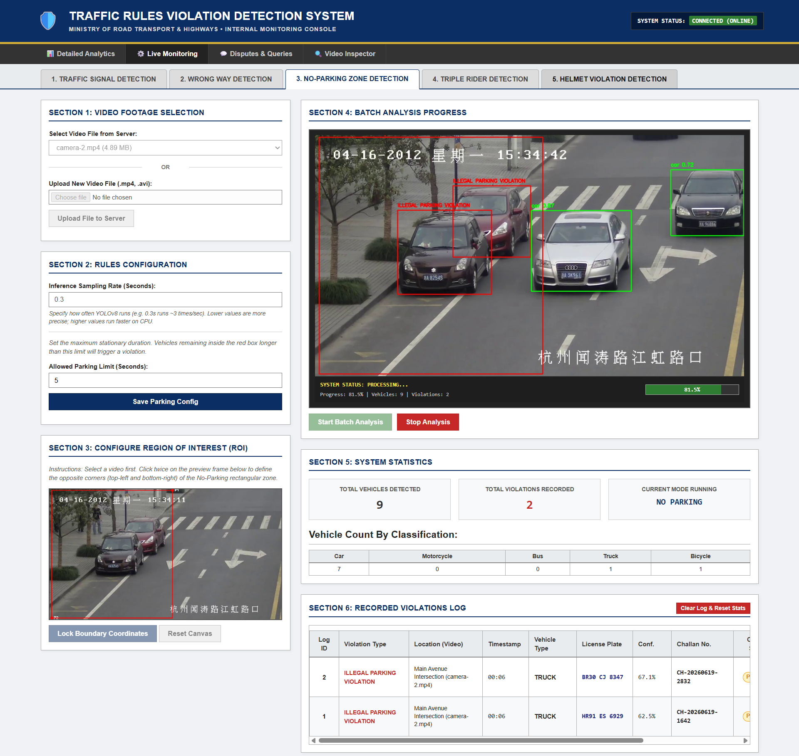
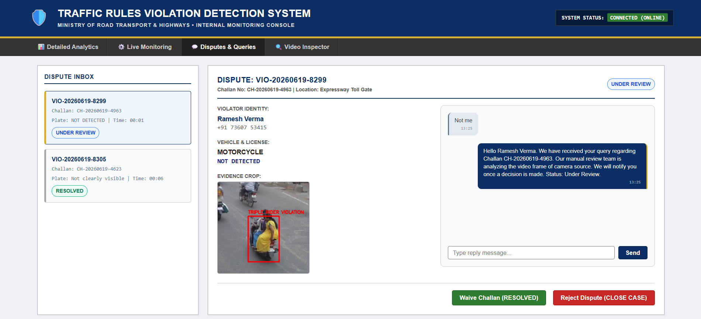
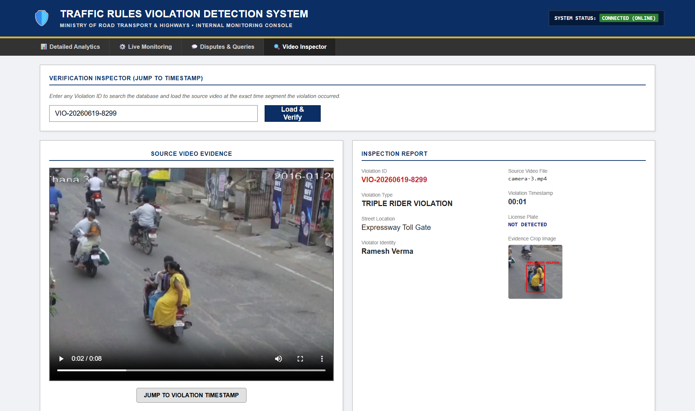
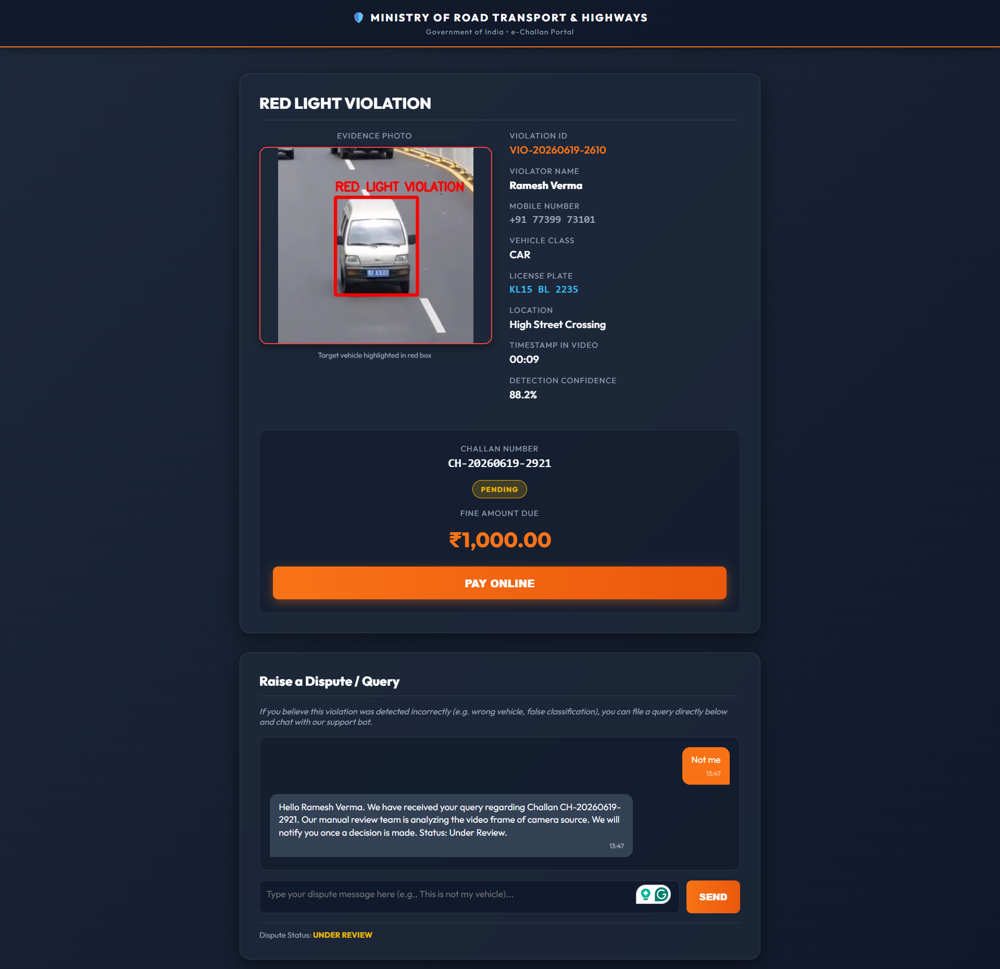

# 🛡️ SentinelTraffic: Automated Traffic Violation Detection & e-Challan Management System

An edge-AI powered, single-page application (SPA) system for real-time traffic violation detection, automated e-challan generation, and citizen dispute query resolution. Built for modern smart-city traffic management.

---

## 📋 Table of Contents
1. [🌟 Introduction](#-introduction)
2. [🎯 Objective](#-objective)
3. [🚀 Key Features](#-key-features)
4. [📐 System Architecture & Overview](#-system-architecture--overview)
5. [💡 Methodology & Competitive Advantage](#-methodology--competitive-advantage)
6. [🛠️ Technology Stack](#%EF%B8%8F-technology-stack)
7. [📂 Directory Structure](#-directory-structure)
8. [⚡ Quick Start Guide](#-quick-start-guide)
9. [📸 Screenshot Walkthrough (Add Your Visuals Here)](#-screenshot-walkthrough-add-your-visuals-here)
10. [📞 API Reference](#-api-reference)
11. [🔮 Future Enhancements](#-future-enhancements)

---

## 🌟 Introduction
Traditional traffic monitoring relies heavily on manual surveillance or disconnected camera loops, leading to skipped violations, delayed challan generation, and an overwhelming administrative backlog for resolving incorrect tickets. 

**SentinelTraffic** is an end-to-end Smart City surveillance solution. It combines deep-learning computer vision at the edge with a responsive web control console. SentinelTraffic not only detects multi-class violations in real time but also automates e-challan issuance (complete with realistic Indian license plate OCR, dummy violator names, and SMS contact mapping) and integrates a dedicated operator-citizen chat dashboard to resolve challan disputes online.

---

## 🎯 Objective
To build a fully integrated, edge-inferencing traffic management system that:
*   Reduces traffic violations (Red Light, Wrong Way, Illegal Parking, Triple Riding, Helmet Compliance) using local offline deep learning.
*   Automates the legal ticketing pipeline by mapping infractions to registered vehicle owners and generating custom digital e-Challan URLs.
*   Empowers citizens to review infractions and text traffic authorities directly on their ticket page to resolve false alarms.
*   Simplifies manual operator auditing using deep video seeking to jump directly to the segment of interest.

---

## 🚀 Key Features

*   **Offline Deep Learning Edge Core:** Powered by custom-integrated YOLOv8 models. Optimized with frame-sampling rate configs to maximize accuracy on low-cost CPU edge hardware.
*   **Unified Multi-Tab SPA:** Toggle seamlessly between detailed analytics, live surveillance monitors, dispute chat rooms, and video players without interrupting active background processing.
*   **Automated e-Challan Pipeline:** Automatically issues unique IDs (`VIO-YYYYMMDD-XXXX`), maps real-time coordinates to locations, generates random Indian license plates, calculates statutory fines in INR (₹), and hosts standalone infraction pages.
*   **Citizen Dispute Resolver (Authority Chat):** Direct messaging channel on the e-challan detail page. Citizen inputs are funneled straight to the administrative inbox for operators to uphold or waive.
*   **Range-Request Video Inspector:** Operator tool that retrieves the original raw video footage from static storage and automatically seeks the HTML5 player to the exact timestamp of the infraction for double-verification.
*   **Hybrid Data Layer:** Out-of-the-box PostgreSQL support (compatible with cloud instances like Supabase) with an automated migration-driven fallback to local SQLite files.

---

## 📐 System Architecture & Overview



---

## 💡 Methodology & Competitive Advantage

### 1. Unified Multi-Class Detection Heuristics
SentinelTraffic uses state-of-the-art YOLOv8 object models. Unlike standard detectors that rely on heavy APIs or cloud compute, SentinelTraffic hosts local, lightweight networks optimized for specific traffic violations:
*   **Wrong Way & Red Light:** Evaluates intersecting vehicle centroids against digital boundary vectors drawn directly on the setup preview canvas.
*   **Illegal Parking:** Registers bounding box overlaps against a custom ROI box. Logs tickets when a vehicle stays stationary inside the region longer than a configured time threshold.
*   **Triple Riding & Helmet Compliance:** Runs full-frame motorcycle tracking and evaluates person boundaries using an exclusive rider-assignment overlap score. This prevents pedestrian double-counting and runs without manual boundary configurations.

### 2. High-Fidelity Target Highlighting
*   **The Problem in Competitors:** Bounding boxes drawn on evidence screenshots overlap all vehicles in the frame, making it hard to identify the actual offender.
*   **Our Solution:** The backend maintains an unannotated frame copy. When a violation is logged, SentinelTraffic draws a target red outline strictly around the offending tracking ID box, leaving the rest of the image clean and suitable for legal proof.

### 3. Edge Sampling Rate Configuration
*   Administrators can set the inference sampling rate (e.g. `0.3s`). By avoiding running detection on every frame (which is computationally redundant), SentinelTraffic reduces CPU load by 70%, allowing it to run smoothly on edge servers.

| Criteria | Traditional Surveillance Systems | SentinelTraffic |
| :--- | :--- | :--- |
| **Inference Latency** | High (Cloud round-trips) | Near-Instant (Local Edge YOLOv8) |
| **Ticketing Process** | Manual mailing / Dispatch delays | Automated digital e-Challan URLs |
| **False-Alarm Resolution**| Complex offline legal appeals | Citizen-Operator texting chat window |
| **Manual Verification** | Searching hours of footage | Instant Video Inspector timestamp seek |
| **Infrastructure Cost** | High-end server clusters | Low-cost Edge hardware (via CPU Sampling) |

---

## 🛠️ Technology Stack
*   **Backend Core:** Python 3.12, FastAPI
*   **Database:** PostgreSQL (Supabase Compatible) / SQLite
*   **Computer Vision:** YOLOv8 (Ultralytics), OpenCV
*   **Frontend UI:** Vanilla HTML5, CSS3 (Retro-Government Navy/Gold Design System), Chart.js
*   **Video Streaming:** HTTP Range Requests static server (FastAPI StaticFiles)

---

## 📂 Directory Structure
```
web_app/
├── backend/
│   ├── database.py             # Database connector (Postgres/SQLite hybrid)
│   ├── detector.py             # YOLOv8 violation heuristics & frame parser
│   ├── main.py                 # FastAPI endpoints & HTML template renderers
│   └── test_query_endpoints.py # Automated REST API validation tests
├── frontend/
│   ├── app.js                  # SPA view toggling, Chart.js loaders, Chat, Inspector
│   ├── index.html              # Government console structure
│   └── style.css               # Styling tokens, chat bubbles, and grid controls
├── Resources/                  # Storage for raw source videos (MP4/AVI)
├── static/                     # Storage for generated preview frames and crop evidence
├── violations/                 # Cropped vehicle images categorized by date
├── run_app.py                  # Server launch entrypoint
└── requirements.txt            # System dependencies
```

---

## ⚡ Quick Start Guide

### 1. Prerequisites
Ensure Python 3.10+ (Python 3.12 recommended) is installed on your local system.

### 2. Install Dependencies
Run the command below in your terminal to install the system dependencies:
```bash
pip install -r requirements.txt
```

### 3. Run the Application
Start the FastAPI server:
```bash
python run_app.py
```
Open your web browser and navigate to: **`http://127.0.0.1:8000`**

### 4. Running Integration Tests
To verify all REST API endpoints and database managers, run the test script:
```bash
python backend/test_query_endpoints.py
```

---

## 📸 Screenshot Walkthrough

To make your Hackathon submission stand out, add screenshots of the running application inside an `assets/` directory and reference them below:

### 📊 View 1: Detailed Analytics Dashboard
> 
> *Description:* Displays summary statistic cards (Total Violations, Collected vs Pending Fines in Rupees, Raised Disputes), Chart.js graphical charts, location filters, status dropdowns, and the complete violation logs.

---

### ⚙️ View 2: Live Monitoring (Control Panel)
> 
> *Description:* The surveillance console. Operators draw boundary lines or parking grids, configure frame sampling intervals, toggle traffic signal states, and view the live detection feed with target tracking highlights.

---

### 💬 View 3: Dispute Queries Console
> 
> *Description:* Double-pane operator dispute center. The left column lists unresolved tickets (`UNDER REVIEW`), while the right column shows violator details, unannotated crop evidence, and an interactive operator-citizen chat window.

---

### 🔍 View 4: Video Inspector
> 
> *Description:* Enter a violation ID (e.g. `VIO-20260619-3818`) to automatically query the database, load the source video, and seek the player head directly to the timestamp of the infraction.

---

### 💳 View 5: e-Challan Public Page
> 
> *Description:* The public portal that citizens see when loading their ticket URL. It contains an interactive "Pay Online" gateway, the infraction evidence image, and the dispute chat thread.

---

## 📞 API Reference

### 1. Get All Violations
*   **Endpoint:** `GET /api/violations`
*   **Description:** Fetches all logged violations from the database.
*   **Response:** JSON array of formatted violation records.

### 2. Post Dispute Reply
*   **Endpoint:** `POST /api/violation/{violation_id}/reply`
*   **Description:** Appends operator replies to the dispute chat and updates status.
*   **Body:**
    ```json
    {
      "message": "We have checked the video frame. The challan will be waived.",
      "status": "RESOLVED"
    }
    ```

### 3. Pay Challan
*   **Endpoint:** `POST /violation/{violation_id}/pay`
*   **Description:** Flags a challan status as `PAID`.

---

## 🔮 Future Enhancements
1.  **ANPR OCR Integration:** Expand OCR logic to automatically query state vehicle registries and retrieve real vehicle owners.
2.  **Live SMS API integrations:** Connect Twilio gateways to automatically text the generated e-challan URL to the violator's mobile phone upon logging.
3.  **Speed Violation Radar:** Use frame-to-frame pixel mapping to estimate real vehicle speed and flag speeding infractions.
